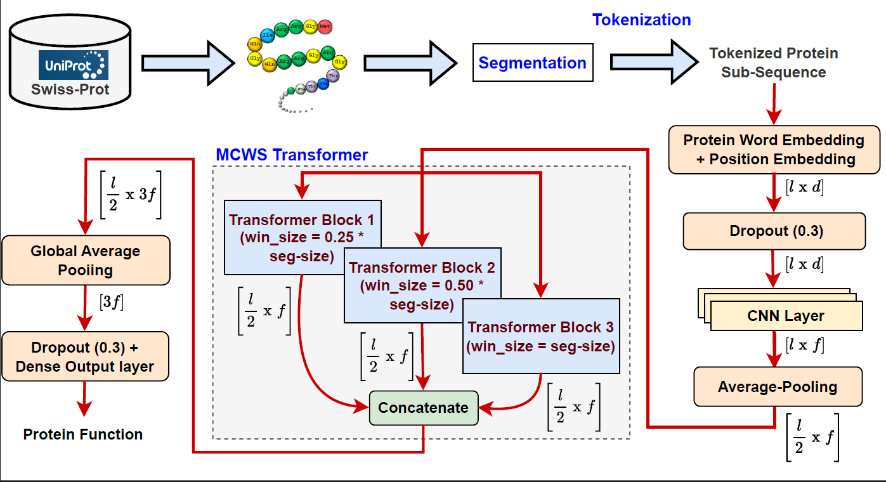

# Fast-CNN-MCWS-transformer
This repository contains the source code for the Fast (CNN + MCWS-transformer)-based architecture for Protein Function Prediction.

This has following main python files.

Segmentation.py - This python file contains the code for doing the segmenation of the protein sequences used for trining the segment encoder.

Fast-MCWS.py - This contains the code for the segment encoder.

train.py - This contains the code for training the segment encoder.

evaluate.py - This contains the code for the evaluation metrics.

The datasets are available for download at google drive: https://bit.ly/3n4giKs

The paper can be cited as: 
Mahala, A., Ranjan, A., Priyadarshini, R., Vikram, R. and Dansena, P., 2025. A fast (CNN+ MCWS-transformer) based architecture for protein function prediction. Statistical Applications in Genetics and Molecular Biology, 24(1).
